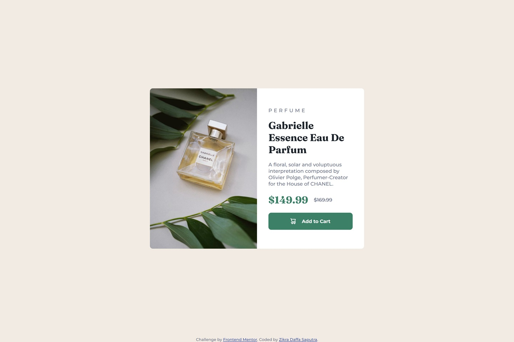

# Frontend Mentor - Product Preview Card Component Solution

This is my solution to the **Product Preview Card Component** challenge on Frontend Mentor. The objective of this project is to recreate a responsive product card while practicing responsive image handling, Flexbox layouts, SCSS, typography, and interactive button states.

## Preview



## Links

- **Live Site:** https://shrigel.github.io/product-preview-card-component/
- **Frontend Mentor Challenge:** https://www.frontendmentor.io/challenges/product-preview-card-component-GO7UmttRfa

## Built With

- Semantic HTML5
- CSS3
- SCSS / Sass
- Flexbox
- CSS Custom Properties
- Responsive Design
- Responsive Images with `<picture>`
- Media Queries
- Google Fonts (Montserrat & Fraunces)

## Layout

The original design was created for the following viewport widths:

- **Mobile:** 375px
- **Desktop:** 1440px

The product card uses a responsive layout that switches from a vertically stacked card on mobile devices to a two-column layout on larger screens.

The `<picture>` element is used to provide different product images for mobile and desktop layouts.

## Style Guide

### Colors

#### Primary

| Color | HSL |
|--------|-----|
| Green 500 | `hsl(158, 36%, 37%)` |
| Green 700 | `hsl(158, 42%, 18%)` |

#### Neutral

| Color | HSL |
|--------|-----|
| Black | `hsl(212, 21%, 14%)` |
| Grey | `hsl(228, 12%, 48%)` |
| Cream | `hsl(30, 38%, 92%)` |
| White | `hsl(0, 0%, 100%)` |

### Typography

**Body Copy**

- Paragraph font size: **14px**

**Montserrat**

- Family: [Montserrat](https://fonts.google.com/specimen/Montserrat)
- Weights: **500, 700**

**Fraunces**

- Family: [Fraunces](https://fonts.google.com/specimen/Fraunces)
- Weight: **700**

## Project Structure

```text
├── images
│   ├── favicon-32x32.png
│   ├── icon-cart.svg
│   ├── image-product-desktop.jpg
│   ├── image-product-mobile.jpg
│   └── preview.jpg
├── styling
│   ├── index-styles.css
│   ├── styles.css
│   ├── styles.css.map
│   └── styles.scss
├── index.html
└── README.md
```

## SCSS

The project uses **SCSS** as the primary stylesheet source.

The `styles.scss` file contains the source styles and is compiled into `styles.css`. The generated `styles.css.map` file is included to support debugging between the SCSS source and compiled CSS.

SCSS nesting is used to organize responsive rules and interactive states:

```scss
.product-card {
    // ...

    @media (min-width: 600px) {
        flex-direction: row;
    }
}

.add-to-cart {
    // ...

    &:hover,
    &:focus {
        background-color: var(--green-700);
    }
}
```

## What I Practiced

Through this project, I practiced:

- Building a responsive product card with Flexbox.
- Using the `<picture>` element for responsive images.
- Creating different layouts for mobile and desktop screens.
- Using SCSS nesting to organize component and media-query styles.
- Managing colors with CSS Custom Properties.
- Combining Montserrat and Fraunces to reproduce the provided typography hierarchy.
- Implementing hover and focus states for interactive controls.
- Using `object-fit: cover` to control image presentation within a responsive container.
- Compiling SCSS into standard CSS for browser use.

## Author

- GitHub - [@shrigel](https://github.com/shrigel)
- Frontend Mentor - [@shrigel](https://www.frontendmentor.io/profile/shrigel)
